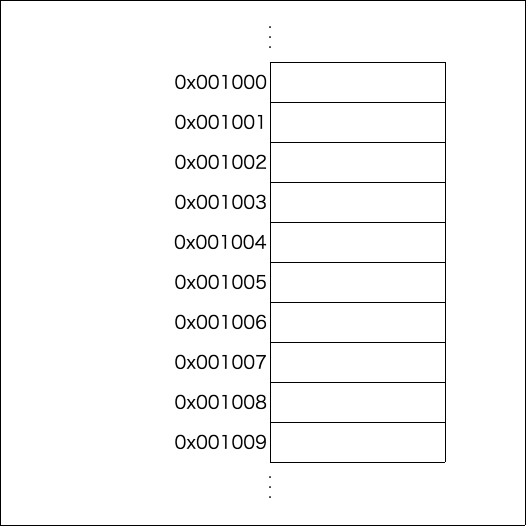
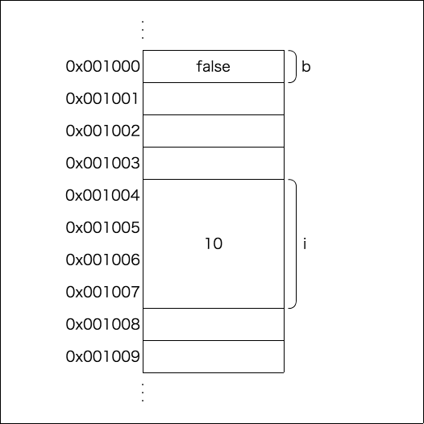
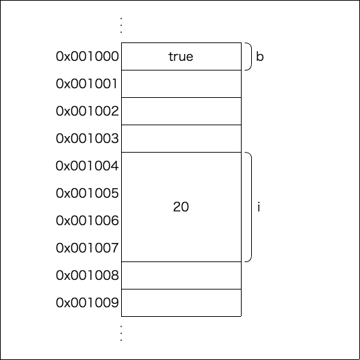
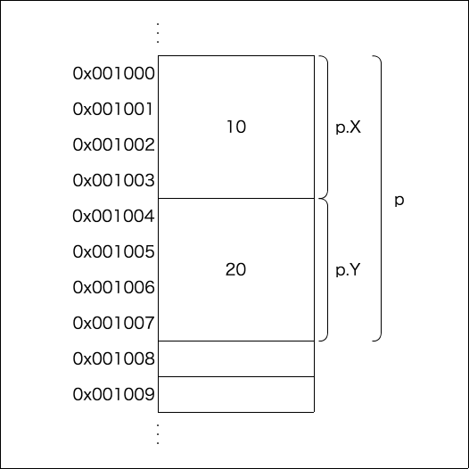
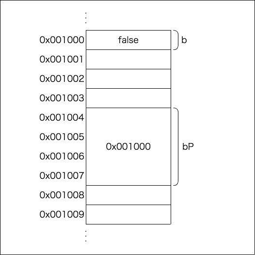
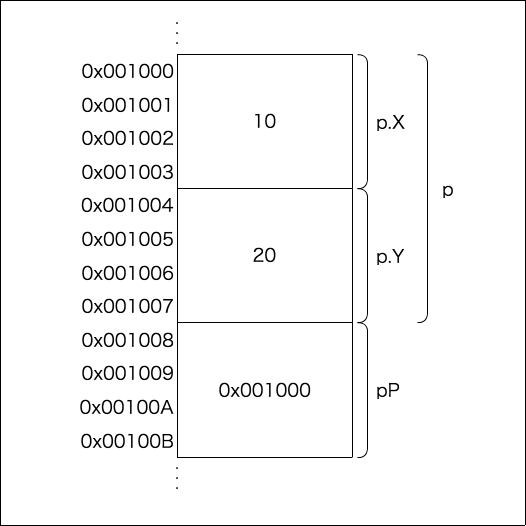
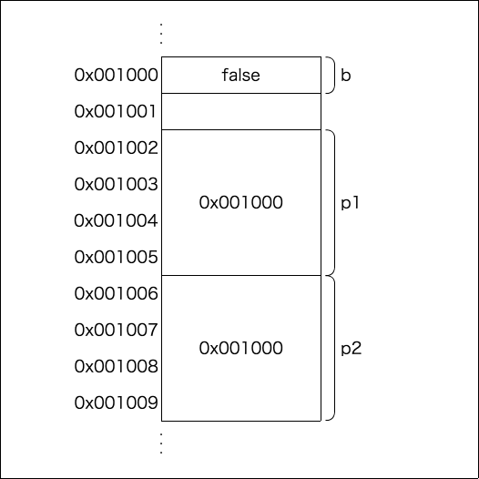

% Go言語のポインタについて
% yamotonalds
% 2017-04-23

# 

## もくじ

- ポインタとは
- ポインタの宣言方法と使い方
- ポインタの使い所

##

Goを初めて日が浅いので

間違いを見つけたら

## やさしくマサカリを


# ポインタとは

## プログラムから見たPCのメモリ

- プログラム実行中に使うデータが置かれるところ
- 1byte単位で使う
- メモリ上の場所（アドレス）は16進数で表記される
    - ex. `0x7fff50f6e1d8`

## 



## 変数を宣言すると

```go
var b bool = false
var i int32 = 10
```

## 

メモリ上にデータが置かれて

変数名でアクセスできるようになる



## 変数に新たな値を代入すると

```go
var b bool = false
var i int32 = 10

b = true
i = 20
```

## 

アドレスは変わらず、そこにあるデータが上書きされる



## アドレスの取得方法

`&` を付けるとそのデータが使用しているアドレスの先頭のものが取れる

```go
var b bool = false
var i int32 = 10

fmt.Printf("%p\n", &b)
fmt.Printf("%p\n", &i)
```

## 実際に見てみましょう

[https://play.golang.org/p/aMAJ45mvxq](https://play.golang.org/p/aMAJ45mvxq)

## structの場合

```go
type Point struct {
  X int32
  Y int32
}

func main() {
  var p Point = Point{X: 10, Y: 20}
}
```

## 



## pとp.Xのアドレス同じじゃない？

. . .

同じです

[https://play.golang.org/p/oIrUg24fJ1](https://play.golang.org/p/oIrUg24fJ1)

##

アドレスだけでは何のデータかわからない。

. . .

⇒ 型もわかれば何のデータかわかる

. . .

型とアドレスでデータを指し示すもの

. . .

⇒ それがポインタ

# ポインタの宣言方法と使い方

## 宣言

型名に `*` を付けるだけ

```go
var b bool = false

var bP *bool = &b
```

※ `&` はアドレス取れるって書いたけど実際はポインタを返してる

## 



[https://play.golang.org/p/xWP2QcOu5W](https://play.golang.org/p/xWP2QcOu5W)

## 宣言(struct)

```go
type Point struct {
  X int32
  Y int32
}

func main() {
  var p Point = Point{X: 10, Y: 20}

  var pP *Point = &p
  var pXP *int32 = &p.X
}
```

## 



[https://play.golang.org/p/Ndr4X1vjHw](https://play.golang.org/p/Ndr4X1vjHw)

## 同じデータを指すポインタが複数あってもよい

```go
var b bool = false
var p1 *bool = &b
var p2 *bool = &b
```

複数の変数から同じデータを触れるようになるので注意が必要

特に並列処理時…

##




## ポインタの使い方

ポインタの変数に `*` を付けると

入ってるアドレスにあるデータ（実体）にアクセスできる(dereference, indirect)

```go
  var b bool = false
  var bP *bool = &b

  fmt.Printf("%t\n", *bP)

  b = true

  fmt.Printf("%t\n", *bP)
```

[https://play.golang.org/p/DRWLPZ_WCr](https://play.golang.org/p/DRWLPZ_WCr)

## ポインタの使い方(struct)

演算子の優先順位に注意すれば後は同じ

```go
type Point struct {
  X int32
  Y int32
}

func main() {
  var p Point = Point{X: 10, Y: 20}
  var pP *Point = &p
  
  fmt.Printf("%d", (*pP).X)  // *pP.X だと X をdereferenceしようとする
}
```

[https://play.golang.org/p/Z0GSu1Fa-D](https://play.golang.org/p/Z0GSu1Fa-D)

## 省略記法

```go
(*pP).X
```

はめんどうなので単に

```go
pP.X
```

に書けるようになってる

## nil

何も指さないアドレスとして `nil` という値が使える

```go
var p *int32 = nil
fmt.Printf("%d\n", *p)  // データにアクセスしようとすると死ぬ(panic)
```

めんどうだけど `nil` チェックはすべき

# ポインタの使い所

## メソッド内で値を変更したい

```go
func Foo(x int) {
  x = 20
}

func Bar(x *int) {
  *x = 20
}

func main() {
  var i int = 10

  fmt.Println(i)  // 10
  Foo(i)
  fmt.Println(i)  // 10 のまま
  Bar(&i)
  fmt.Println(i)  // 20
}
```

[https://play.golang.org/p/BYZlxqonSw](https://play.golang.org/p/BYZlxqonSw)

## コピーされるサイズを減らす

例

- メソッド引数
- rangeループの一時変数
- メソッドレシーバ

## メソッド引数

```go
type Big struct {
  value [1000]int32
}

func Foo(foo Big) {
  // 何か処理...
}

func Bar(bar *Big) {
  // 何か処理...
}

func main() {
  var big Big = Big{}
  
  Foo(big)   // big から foo にBigの中身全部(4000byte)コピーされる
  Bar(&big)  // &big が bar にコピーされるが、ポインタなので8byteしかコピーされない
}
```

## rangeループの一時変数

sliceやmapをループで処理する場合、ループ変数に値がコピーされる

```go
var bigs [100]Big
for _, b := range bigs {  // ループごとに要素がbにコピーされるのでループ全体で100*1000byteコピーされる
  // ...
}
```

`bigs` の要素が実体ではなくポインタだと100*8byteのコピーで済む

（伝統的な `for i := 0; i < 100; i++ {}` による添字ループでも回避は可能）

## メソッドレシーバ

Goでは↓のようにしてstructにメソッドを生やせる

```go
type Point struct {
  X int32
  Y int32
}

func (p Point) Print() {
  fmt.Println(p.X, p.Y)
}

func main() {
  var point Point = Point{}
  point.Print()
}
```

##

```go
func (p Point) Print() {
  fmt.Println(p.X, p.Y)
}
```

この `(p Point)` のところの `p` をメソッドレシーバという

##

メソッドレシーバはコピーで値が渡されるので

```go
func (p Point) Inc() {
  p.X += 1
  p.Y += 1
}
```

はメソッド呼び出しの度にstructがコピーされる

また、コピーされた値を変更しているので呼び出し元の値は変わらない

##

ポインタレシーバにすると

```go
func (p *Point) Inc() {
  p.X += 1
  p.Y += 1
}
```

ポインタがコピーされ、呼び出し元の値が変更される

[https://play.golang.org/p/m6pTu46L-b](https://play.golang.org/p/m6pTu46L-b)

##

↓のものはサイズが小さいのでコピーを減らす意図でポインタにする意味はほぼ無い

- int, bool等のprimitive型
- string
- slice, map, channel（makeで作るやつ）

※ `unsafe.Sizeof(x)` で変数xのメモリ上のサイズがわかる

## オプショナルを表現

Goに限った話ではなく、「指定が無ければデフォルト」とかを表現

```go
func Greet(message string, gobi *stirng) {
  if gobi != nil {
    fmt.Println(message + *gobi)
  } else {
    fmt.Println(message)
  }
}
```

[https://play.golang.org/p/pJczZ3QDiX](https://play.golang.org/p/pJczZ3QDiX)

##

ただ、nilを使ったオプショナルの表現は多用するとひどいコードになりがち

まずは別の設計を検討してみると良い

- 1つのメソッドでいろいろやらずにメソッドをわける
- struct（クラス）をわけてinterfaceを使う

etc...

## cgoでC言語とやりとり

GoはC言語を扱える

C言語はポインタを要求する関数が多い

```go
package main

/*
void inc(int* i) {
  *i += 1;
}
*/
import "C"
import (
  "fmt"
)

func main() {
  var x C.int = C.int(10)
  C.inc(&x)
  fmt.Println(x)
}
```

# まとめ

## まとめ

- ポインタは型とアドレスでメモリ上のデータを指し示すもの
- 主に↓のような目的で使う
    - 参照渡しでメソッド内でデータを変更する
    - データコピーを減らす
    - オプショナルを表現
- `nil` は何も指していないことを表現

## メソッドレシーバについて

[🍠]基本的にはポインタレシーバでよいのでは？

- コピーが少なくなる
- structのデータ変更が直感的

Immutableなstructにしたい場合等に値レシーバを検討
（バリューオブジェクトには値レシーバが良さそう）

## 参考

Go 言語の値レシーバとポインタレシーバ
[https://skatsuta.github.io/2015/12/29/value-receiver-pointer-receiver/](https://skatsuta.github.io/2015/12/29/value-receiver-pointer-receiver/)

Functional options for friendly APIs
[https://dave.cheney.net/2014/10/17/functional-options-for-friendly-apis](https://dave.cheney.net/2014/10/17/functional-options-for-friendly-apis)


